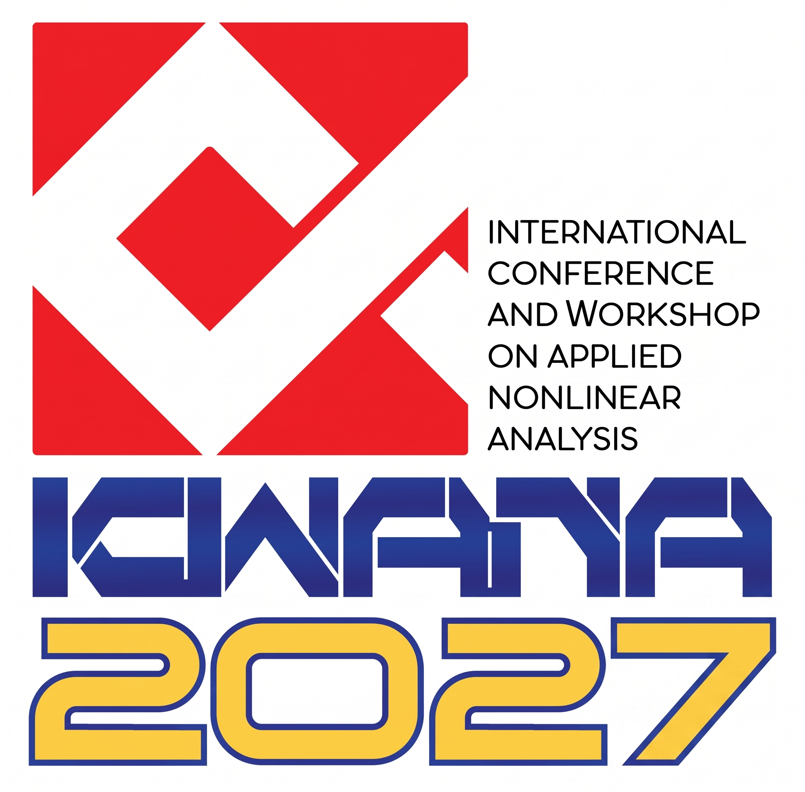
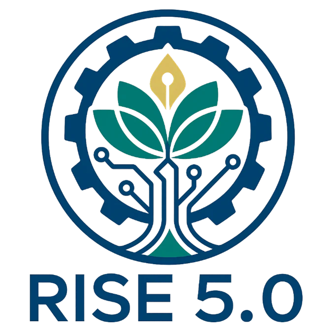
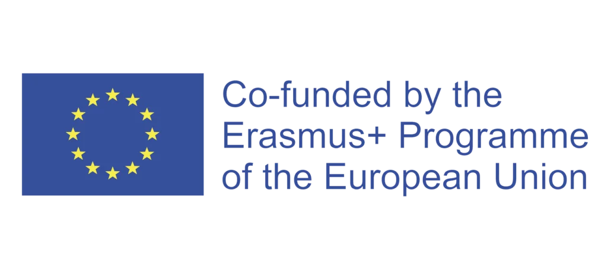

  

  # ICWANA2027
  **The 5th International Conference and Workshop on Applied Nonlinear Analysis**  
  📅 **July 28–31, 2027** | 📍 **Pattaya Beach, Chonburi, Thailand**

  🌐 **Official Website:** [https://icwana2027.github.io/](https://icwana2027.github.io/)

---

## 📖 About the Conference
The 5th International Conference and Workshop on Applied Nonlinear Analysis (**ICWANA2027**) brings together leading experts, researchers, and young scholars in the field of nonlinear analysis, with a particular focus on fixed point theory, variational inequalities, optimization, and their applications in science, engineering, data science, and economics.

### 🗓️ Important Dates
| Event | Date |
| :--- | :--- |
| **Abstract Submission Deadline** | May 31, 2027 |
| **Notification of Acceptance** | June 20, 2027 |
| **Early Bird Registration** | June 30, 2027 |
| **Conference Dates** | **July 28–31, 2027** |

---

## 📁 Project Structure (คู่มือการแก้ไขเว็บไซต์สำหรับผู้ดูแล)

เว็บไซต์นี้ออกแบบด้วยโครงสร้างแบบ **Modular HTML** (แยกส่วนตามหมวดหมู่) เพื่อให้แก้ไขข้อมูลแต่ละส่วนได้ง่ายโดยไม่ต้องไล่โค้ดยาว หากต้องการอัปเดตข้อมูลบนหน้าเว็บ สามารถคลิกแก้ไขไฟล์ย่อยตามตารางด้านล่างนี้ได้ทันที:

| ชื่อไฟล์ (File Name) | ส่วนที่แสดงผลบนหน้าเว็บ (Section) | ข้อมูลที่แก้ไขได้ในไฟล์นี้ |
| :--- | :--- | :--- |
| `index.html` | **โครงสร้างหลักของเว็บ** | ตั้งค่า `<head>`, โหลด Tailwind CSS, MathJax (LaTeX) และสคริปต์ดึงไฟล์ย่อยมารวมกัน *(ปกติไม่ต้องแก้ไขไฟล์นี้)* |
| `navbar.html` | **แถบเมนูด้านบน (Navigation Bar)** | โลโก้มุมซ้ายบน และลิงก์เมนูนำทางไปยังส่วนต่างๆ |
| `hero.html` | **ส่วนหัวเว็บหน้าแรก (Hero Banner)** | โลโก้หลักของงาน, ชื่องานประชุม, วันที่, สถานที่จัดงาน และปุ่ม Register / Submit Abstract |
| `about.html` | **เกี่ยวกับงาน & ประวัติงาน (About)** | รายละเอียดงาน, หัวข้อวิจัย (Key Research Topics) และไทม์ไลน์การจัดงานครั้งที่ 1–5 |
| `dates-program.html` | **วันสำคัญ & กำหนดการ (Dates & Program)** | กำหนดการส่งบทคัดย่อ/ลงทะเบียน (Important Dates) และตารางกิจกรรมทั้ง 4 วัน (Tentative Program) |
| `speakers.html` | **วิทยากรรับเชิญ (Speakers)** | รายชื่อ รูปภาพ และสังกัดของ Plenary Speakers และ Invited Speakers |
| `abstract-journals.html` *(หรือ `abstract.html` & `journals.html`)* | **การส่งบทคัดย่อ & วารสาร (Abstract & Journals)** | ขั้นตอนการส่ง Abstract, ลิงก์ดาวน์โหลด LaTeX Template และรายชื่อวารสาร Special Issues (Bangmod J-MCS, NCAO) |
| `registration-committees.html` | **การลงทะเบียน & คณะกรรมการ** | ลิงก์ Google Form ลงทะเบียน, อัตราค่าลงทะเบียน และรายชื่อกรรมการ (Scientific, Organizing, Co-Chair & Technical Committee Secretary) |
| `footer.html` | **ส่วนท้ายเว็บ & ผู้สนับสนุน (Footer, Sponsors & Contact)** | โลโก้ผู้สนับสนุน (RISE 5.0, Erasmus+ EU), ที่อยู่ติดต่อเลขานุการงานประชุม (TaCS-CoE, KMUTT), อีเมล, เบอร์โทรศัพท์ และลิงก์ที่เกี่ยวข้อง |
| `logo.jpeg` | **ไฟล์รูปโลโก้งาน** | รูปภาพโลโก้หลักของงาน ICWANA2027 |
| `riselogo.webp` & `erasmus.webp` | **ไฟล์รูปโลโก้ผู้สนับสนุน** | รูปโลโก้โครงการ RISE 5.0 และ Erasmus+ Programme of the European Union |

---

## ✏️ วิธีการอัปเดตข้อมูลบนเว็บไซต์ (How to Update)
1. คลิกที่ไฟล์ `.html` หมวดหมู่ที่ต้องการแก้ไขจากรายการไฟล์ด้านบน
2. กดไอคอน **รูปดินสอ (Edit this file)** ที่มุมขวาบน
3. แก้ไขข้อความ ลิงก์ หรือข้อมูลตามต้องการ (สามารถพิมพ์สมการคณิตศาสตร์ LaTeX ด้วยเครื่องหมาย `$...$` หรือ `$$...$$` ได้ในทุกไฟล์)
4. กดปุ่มสีเขียว **`Commit changes...`** มุมขวาบน
5. รอประมาณ 1–2 นาที เว็บไซต์ที่ [https://icwana2027.github.io/](https://icwana2027.github.io/) จะอัปเดตข้อมูลใหม่อัตโนมัติ

---

## 🤝 Sponsors & Partners

  
  

---

## 📬 Contact
**Prof. Dr. Poom Kumam**  
Center of Excellence in Theoretical and Computational Science (TaCS-CoE), Faculty of Science,  
King Mongkut's University of Technology Thonburi (KMUTT),  
126 Pracha-Uthit Road, Bang Mod, Thung Khru, Bangkok 10140, Thailand  
* **Email:** [iwana2022bangkok@gmail.com](mailto:iwana2022bangkok@gmail.com)
* **Tel:** (+66) 2470-8994
* **WG-ANA Network:** [https://wganacom.wordpress.com/](https://wganacom.wordpress.com/)
